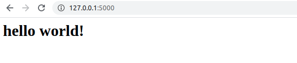

# Flask-Samples
Some Python Flask samples

# Preinstallation

Install flask

```console
$ pip3 install flask
```

# How to run Helloworld?

First, set variable **FLASK_APP** in terminal:
```console
$  export FLASK_APP=$('pwd')/helloworld.py
```

Second, in terminal run: 
```console
$ flask run
```

Debug Mode, just set **FLASK_DEBUG**:
```console
$ export FLASK_DEBUG=1
```

# Check Your localhost web page
